# Final Project

## Team

Alan Hsieh - amh425

Henry Wu - hw574

Tsung-Yin Hsieh - th542

## Functional Check

[**Here is the Link to the video of our Functional Check-off**](https://youtu.be/vCQwhBj05Pg)

## Project Plan

### Big Idea

We are building a Party Christmas Tree which is a must for us to have a party. The party Christmas Tree will vibrate when seeing people dancing in front of it. And people can control the lights and music of trees by MQTT. Furthermore, the tree can detect the age of the person and give different interactions (e.g. ask a child to take gifts when they detect a child passing by). We believe that this tree is the tree that everyone needs at home.

### Timeline

11/22: Confirm the materials we need for Raspberry Pi

11/29: Finish Function Design/Test

12/06: Final Presentation

### Parts Needed

- Interactive Christmas Tree with Light, Vibration and Music
- Sensors: Webcam, Microphone
- Control: Buttons, Rotate Encoder, MQTT, servo motor

### Risks/Contingencies

- The tree may not recognize dance accurately because it is hard to separate dance and other actions by the machine learning approach.
- Given that the tree is tall and heavy, it is hard to make the tree vibrate. We may need a powerful motor or vibration device for our project.

### Fall-back Plan
- The tree may not recognize dance accurately, so we might make easier detection. The tree may interact with a person when it detects a person stand in front of it.
- If the vibration of tree doesn't work, we may use light effects (changing or blinking colors) to interact with people instead of using vibration.

Here is what we are going to present in the class:

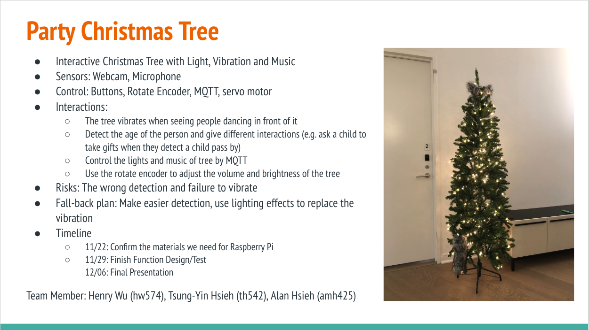

Using the tools and techniques you learned in this class, design, prototype and test an interactive device.

Project plan - November 15

Peer feedback on Project plans: November 17

Functional check-off - November 29 & December 1

Final Project Presentations - December 6

Write-up and documentation due - December 12

## Deliverables

1. Documentation of design process

    We plan to design this interactive party Christmas tree, because we think it's almost Christmas time and everyone will have a party in their house at Christmas time, we want to have a party Christmas tree to increase the atmosphere of Christmas.

    About our party christmas tree, we designed three interactive parts, first we want our party christmas tree to detect when someone is dancing and the Christmas tree will sing Christmas songs, we thought of this because at Christmas time when people are dancing we want the Christmas tree to sing to make everyone feel more Christmas atmosphere.

    Secondly, we hope that our Christmas tree will have different eyes in different interactive situations, because we hope that our Christmas tree will give you a real human feeling.

    Thirdly, our Christmas tree will detect different conditions and its Led strip will emit different light. We hope that by having the Christmas tree glowing. To make the Christmas tree shine like the highlight of the party.

    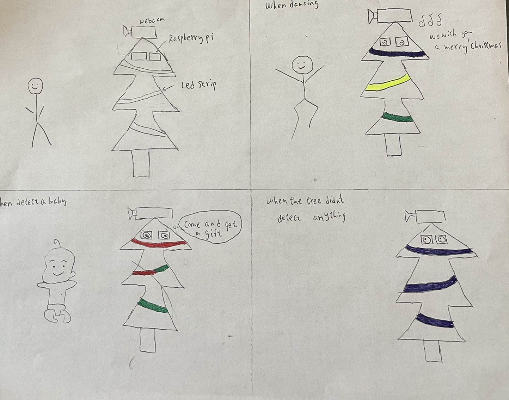

2. Archive of all code, design patterns, etc. used in the final design. (As with labs, the standard should be that the documentation would allow you to recreate your project if you woke up with amnesia.)

    The following image show the big idea of our design patterns.

    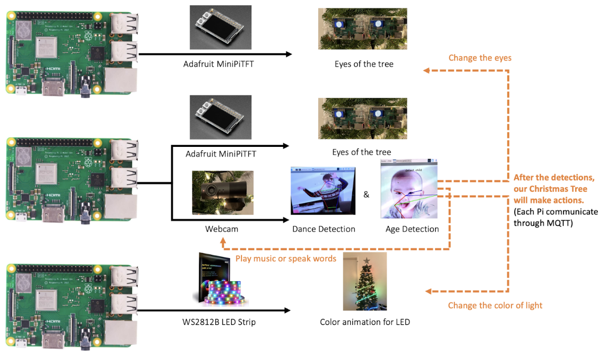

    We use three Raspberry Pi to build our final design. The first Raspberry Pi is used for Pose and Age Detection and a monitor of one eye. The second Raspberry Pi is used for a monitor of one eye. The third Raspberry Pi is used for controlling the action of the LED light strip. We will explain how we will build our interaction features in the following paragraphs.

    (a) Detecting dance

    Use the webcam to capture the video frame, and use pre-trained Tensorflow models to detect a person’s pose. The output of the model is the coordinates of human body joints. The system determines a person dancing if the coordinates of elbows and wrists are higher than coordinates of shoulders. If it detects that a person is dancing, then it will send a topic: “dance” to MQTT.

    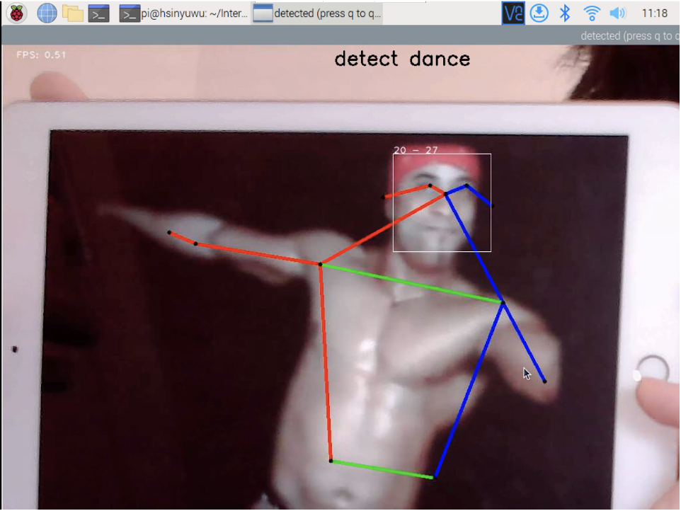

    (b) Child Detection
    
    Use the webcam to capture the video frame, and use opencv model to detect and capture a human face. Then, we use the cropped human face image as the input of the pre-trained age detection Tensorflow model and get the prediction of the human ages. If it detects that a human age is lower than 8 years old, then it will send a topic: “child” to MQTT.
    
    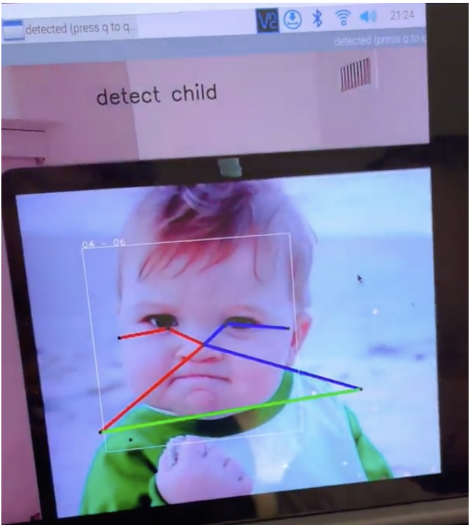

    (c) Monitor

    We used two Raspberry Pi as the eyes of our christmas Tree and connected Raspberry Pi through MQTT. We want to make different interactions in different situations to make our Christmas Tree more energetic and interesting. 
    
    1. When the Tree detects people dancing, the eyes on the monitors would become the first picture.

    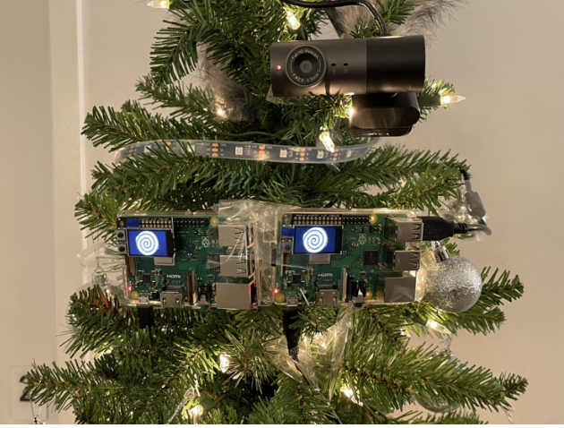

    2. When the Tree detects a child, the eyes on the monitors would become the second picture. 

    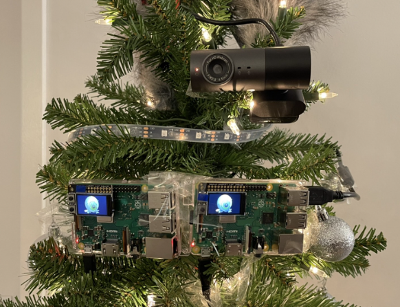

    3. When the Tree didn’t detect anything, the eyes on the monitors would become the third picture. 

    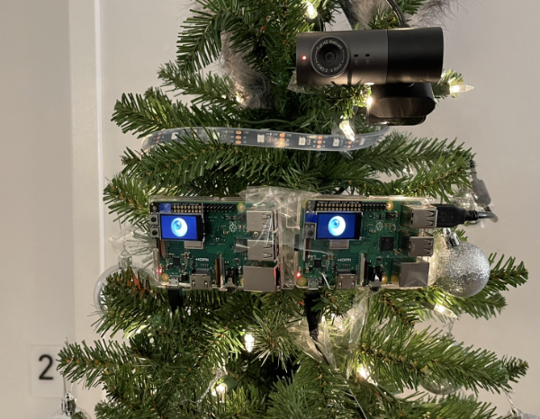

    (d) Speaker

    We add the built-in speaker in the webcam to play music or speak words. When the people are dancing, the Christmas tree will play Christmas songs (in this case, we play “We wish you a Merry Christmas” ) which means we are currently having a Christmas party.

    When a child is in front the tree, the tree will tell the child to come and get a gift
    We want to make our party christmas tree to work in different situations to let people enjoy more about the atmosphere of Christmas
    
    (e) LED Strip

    We connect the LED Strip with a Raspberry Pi by three inputs (5V, Ground, and GPIO 10). The color of the light strip will change as the interactions happen between users and our Christmas tree. There are also three situations in the interaction process of our Christmas tree.

    1. When the Tree detects people dancing in front of it, the color of the light strip will turn into a blinking rainbow color.

    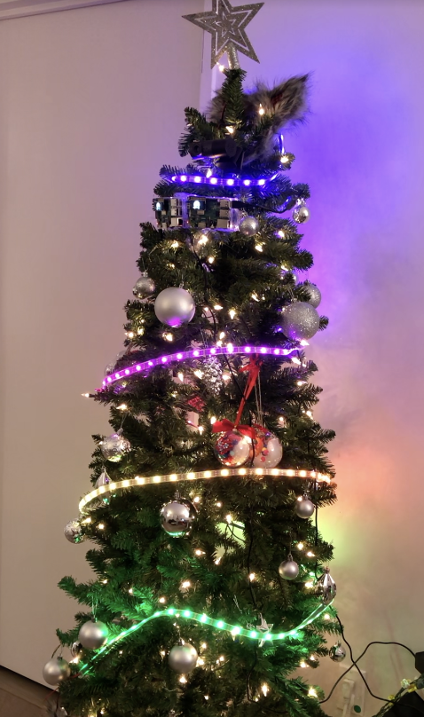

    2. When the Tree detects a child standing in front of it,  the color of the light strip will change between red and green. 

    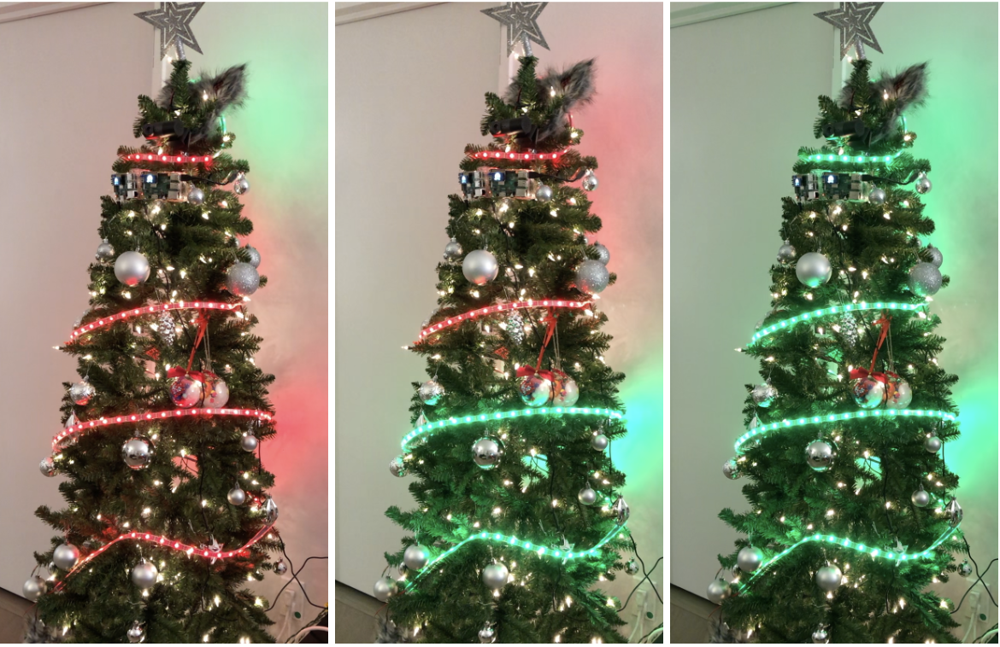

    3. When the Tree didn’t detect anything in front of it, the color of the light strip will change between white and yellow.

    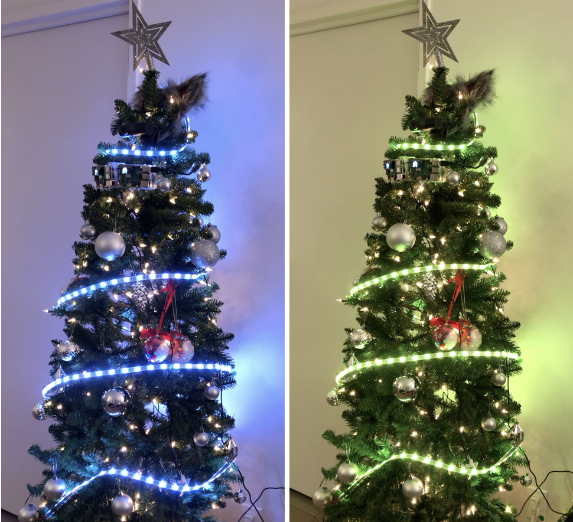
    
3. Video of someone using your project

    Detect dance:
    [**Detect dance**](https://drive.google.com/file/d/15rq2gmozHBc9oLVDd4Webw9dt2ICojxL/view?resourcekey)
    
    Detect child:
    [**Detect child**](https://drive.google.com/file/d/1pI7sU4DAIQ9wkEXhG7b2UO2wdmEWDO99/view?resourcekey)

4. Reflections on process (What have you learned or wish you knew at the start?)

    We spend a lot of time finding a way to deploy pre-trained tensorflow models on the raspberry pi. We did not install the whole tensorflow package on the device because it consumed too much storage. Instead, we installed the tensorflow runtime package for deploying models.
    
    On top of that, we also met some hardware problems on changing the color of our LED Strip. In the beginning, the color of the LED strip didn’t change as we programmed and sometimes turned into unexpected white light. At last, we spent lots of time searching solutions from the Internet and finally made the color changing work by changing the GPIO input of the LED strip and adjusting the frequency of the LED strip. We believe that we need to gain more understanding of hardware for Raspberry Pi, so we can develop the interactions we want in a more efficient way. 
    
    We wished that we could realize the significant delay of MQTT communication between devices. Because of the delay, our party Christmas tree could not respond to people immediately and impact the user experience. If we could realize this issue earlier, we could find better ways to communicate between devices.

5. Group work distribution questionnaire
    
    Team work
    We discussed the features and how to implement our systems together in the beginning, and we built different features separately. At last, we integrated our features into on system with MQTT and completed the final writeup of this project.
    
    Alan Hsieh - amh425
    
    Eyes animation for the Christmas tree, MQTT receive and send, Final writeup
    
    Henry Wu - hw574
    
    Dance and Age detection for the Christmas tree, MQTT receive and send, Final writeup
    
    Tsung-Yin Hsieh - th542
    
    Color animation of LED Strip for the Christmas tree, MQTT receive and send, Final writeup

## Change of Design

It is fine to change your project goals, but please resubmit the project plan for the new design when you do that.

## Teams

You can and are not required to work in teams. Be clear in documentation who contributed what. The total project contributions should reflect the number of people on the project.

## Examples

[Here is a list of good final projects from previous classes.](https://github.com/FAR-Lab/Developing-and-Designing-Interactive-Devices/wiki/Previous-Final-Projects)
This version of the class is very different, but it may be useful to see these.
